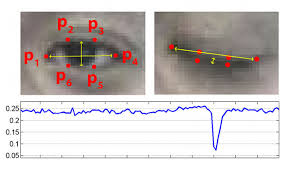

# Drowsiness_Detection
- Detect drowsiness with help of Facial Land marks and Eye aspect ratio

## Libraries and API's
- OpenCV
- dlib
- Imutils
- scipy
## Resources
- [Music](http://freesound.org/)
## Info
- When Eye Aspect Ratio is less than threshold for certain frames(Continuous) ,It triggers Alarm  
- Used dlib library to detect face and then landmark detection
- The EAR ratio is used to detect eyeblink which is a result of work by [Soukupová and Čech](http://vision.fe.uni-lj.si/cvww2016/proceedings/papers/05.pdf)
- Used an inbulit music player(mpg123) for triggering the alaram

EAR during Blink            |  Formula
:-------------------------:|:-------------------------:
|  
